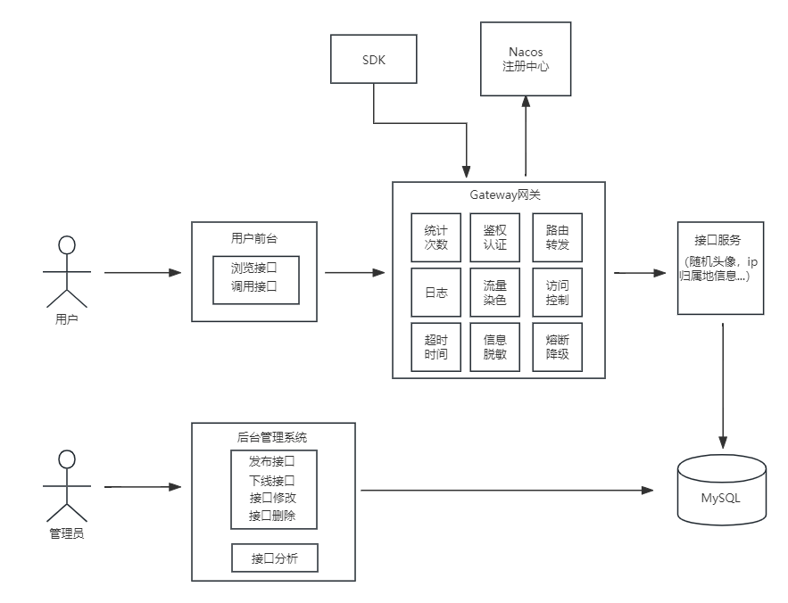
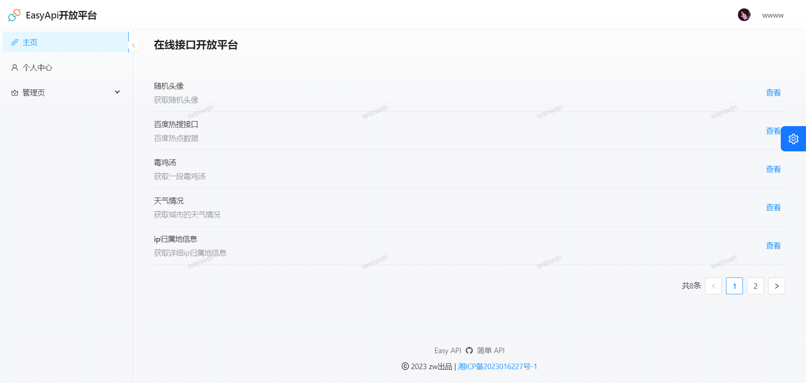
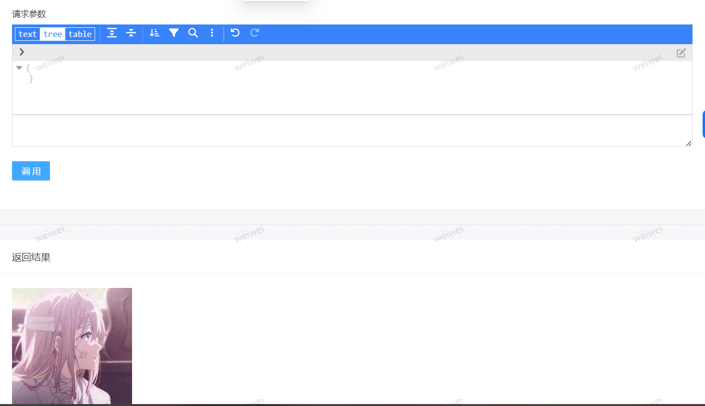
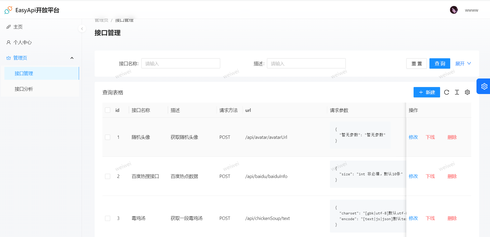
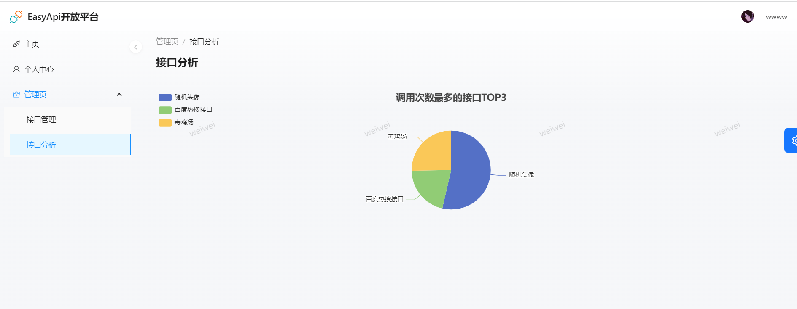
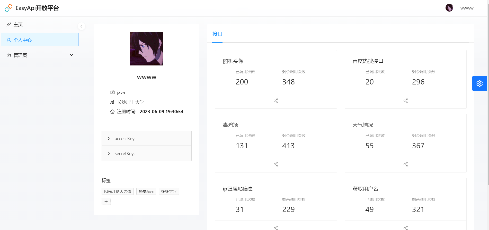
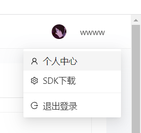

# Easy API :rainbow: 

> 一个丰富的 API 开放调用平台，提供了一些接口调用服务，方便大家使用。
>
> 这是一个全栈前后端分离项目，前端使用 `React`， 后端使用 `Java`，现已上线，后续还会继续扩展优化。
>
> 在线体验地址：[Easy API](http://www.api.ggbond.online/)


## 项目背景 📖

API平台有很多，但是不够统一，本平台帮助企业、个人统一开放接口，减少沟通成本，避免重复造轮子，为业务高效赋能。

**Easy API平台力求给用户提供简洁、实用的接口调用体验，并且使用API签名校验保障接口调用的安全性**


## 系统架构 :star:

   


## 技术栈 🔥

### 前端技术栈

- 开发框架：React、Umi
- 脚手架：Ant Design Pro
- 组件库：Ant Design、Ant Design Components
- 语法扩展：TypeScript、Less
- 打包工具：Webpack
- 代码规范：ESLint、StyleLint、Prettier
- 图表：ECharts


### 后端技术栈

- 主语言：Java
- 框架：SpringBoot 2.7.2、Mybatis-plus
- 数据库：Mysql5.7、Redis
- 注册中心：Nacos
- 服务调用：Dubbo
- 网关：Spring Cloud Gateway
- 前后端联调：Swagger，Knife4j


## 项目模块

- easyapi-frontend ：项目前端，前端项目启动具体看readme.md文档
- easyapi-common ：公共封装类（如公共实体、公共常量，统一响应实体，统一异常处理）
- easyapi-backend ：接口管理平台，主要包括用户、接口相关的功能
- easyapi-gateway ：网关服务，涉及到网关限流，统一鉴权，统一日志处理，流量染色，接口统计等等
- easyapi-interface：接口服务，提供可供调用的接口
- easyapi-client-sdk：提供给开发者的 SDK


## 功能模块 🎊

> 🌟 亮点功能   
>
> 🚀 未来计划

- 用户、管理员
  - 登录注册注销
  - 个人主页
  - 管理员：接口管理
  - 管理员：接口分析
  
- 接口
  - 浏览接口信息
  - 🌟 数字签名校验接口调用权限
  - 🌟 SDK调用接口
  - 下载SDK
  - 用户上传自己的接口（🚀）
  


## 项目展示 :framed_picture:


- 首页




---

- 接口详情

  

  


---

- 接口管理




---

- 接口分析




---

- 个人中心




---

- SDK下载



---


## 快速上手 🏃‍♂️

### 后端

1. 将各模块配置修改成你自己对应的端口、账号、密码等等
2. 启动Nacos、Mysql、Redis、RabbitMQ（如需修改依赖版本，请自行查找对应适配版本）
3. 将公共服务 easyapi-common 以及下载的 SDK 安装（install）到本地maven仓库
4. 按顺序启动服务

服务启动顺序如下，仅供参考：

1. easyapi-backend

2. easyapi-gateway

3. easyapi-interface

   

### 前端

环境要求：Node.js >= 16

安装依赖：

```
npm i @ant-design/pro-cli -g
npm i
```

启动：

```
npm run start:dev
```


## 欢迎贡献

项目需要大家的支持，期待更多小伙伴的贡献，你可以：

- 对于项目中的Bug和建议，能够在Issues区提出建议，我会积极响应


